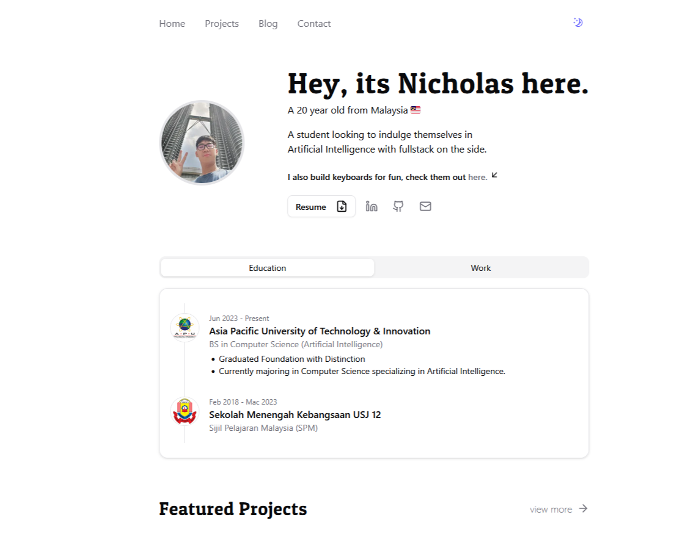

# My Personal Portfolio

A clean, minimal portfolio website built with Next.js, Tailwind CSS and Shadcn UI. Featuring a simple blog design.


## Live Demo

🌐 Check it out here: **[https:fraxtal.github.io/npts](https:fraxtal.github.io/npts)**



## Features

- Minimal design with Shadcn UI
- Light/dark mode toggle
- Responsive mobile design
- Blog section

## Tech Stack

- Next.js
- Tailwind CSS
- Shadcn UI

## Getting Started

```bash
git clone https://github.com/Fraxtal/npts npts
cd npts
npm install
npm run dev
```

## Customization

- Update personal info in `src/data/*.json`
- Replace projects in `src/data/projects.json`
- Replace blog posts in `content/` or remove it.
- Add your resume to `public/resume.pdf`

## Deployment

Deploy to Vercel:

1. Push to GitHub
2. Connect repo to Vercel
3. Add environment variables
4. Deploy

## License

MIT

_This project is highly inspired/based on the design of [Ted](https://github.com/tedawf)._
